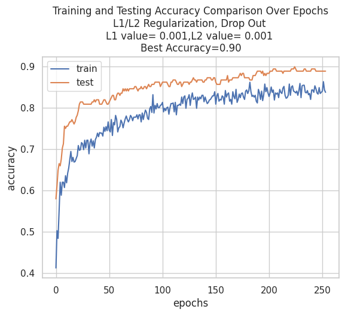
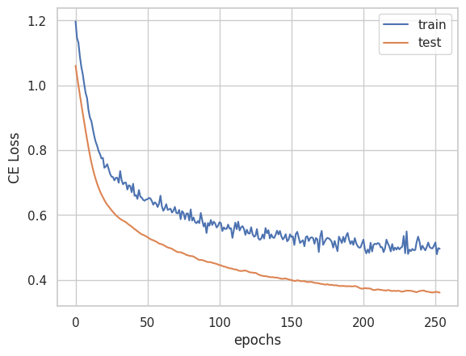
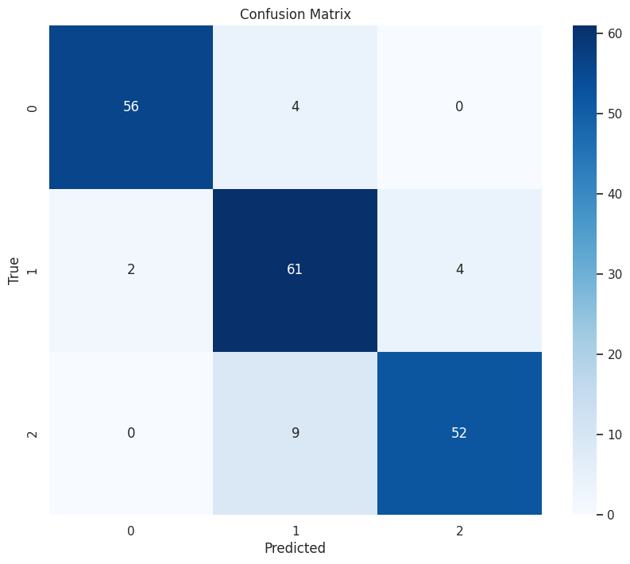

# Predicting California Forest Fire Intensity with PyTorch
 Using PyTorch to predict forest fire intensity in California

 In this project, the Forest Fire Dataset from NASA was utilised to examine if, using machine learning techniques, the intensity of forest fires can be predicted through classification using the different variables provided.

## Dataset 

The Original Dataset from the Forest Fire Dataset of NASA  was processed for the Final Project of INFO247 in Spring 2023. The processed dataset with 175k datapoints is used for this project. The dataset is further processed to suit the needs of this project.
The key fields in this dataset are : -

1. ‘FID’- ID
2. ‘latitude’
3. ‘longitude’
4. ‘brightness’-brightness value
5. ‘acq_time’-time the fire was detected
6. ‘confidence’- statistical confidence in the fire detection
7. ‘frp’ 
8. ‘daynight’ -whether day or night
9. ‘year’ - Year when the fire was detected
10. ‘Month'-Month of Fire Detection
11. ‘CALVEGZONE’-California Vegetation Zone
12. ‘FORESTNAME’-National Forest Name
13. ‘date’-Date of Fire Detection
14. ‘county_name’-Name of the California County where the fire was detected

## EDA and Feature Engineering

EDA was carried out to understand the different fields of the dataset. There were no NaN values. Observed that two fields “‘FID’’ and “Unnamed: 0” were only datapoint numbers and not providing any relevant information. 
The field “brightness” is providing a measure of brightness of the forest fire detected by the satellite sensor. This value can provide a measure of intensity of the fire with higher values representing larger fires. Using Pandas function “pd.cut” , categorization of the “brightness” field into 'brightness_category' with three categories was carried out. 

“Date” feature was engineered to generate 'weekday',’week’ and ‘timestamp’ features. The latitude and longitude features were converted to “x”, “y” and “z” values.

## Base Model

- Framework - PyTorch
- Type-Multi-Class classification Feedforward Neural Network
- Loss function - CrossEntropy 
- Activation function- Adam
- Dataloading - Batch loading
- Learning rate - 0.001
- Model performance monitored in each batch and epoch. 

<pre>

class Multiclass(nn.Module):
    def __init__(self):
        super().__init__()
        self.hidden = nn.Linear(input_size,25)
        self.act = nn.ReLU()
        self.output = nn.Linear(25, output_size)

    def forward(self, x):
        x = self.act(self.hidden(x))
        x = self.output(x)
        return x

</pre>

## Techniques Utilized

- Exploratory Data Analysis
- Feature Engineering 
- Undersampling 
- Feature Selection
- L1/L2 Regularization
- Drop Out 
- Batch Normalization
- Early Stopping 

## Best Performance

We were able to obtain the highest performance of 90%. 

### Accuracy vs Epochs Plot

### Cross-Entropy Loss vs Epochs Plot

### Confusion Matrix

## Acknowledgement

* This research benefited from the support and services of UC Berkeley's Geospatial Innovation Facility (GIF), https://gif.berkeley.edu .

* We acknowledge the use of data and/or imagery from NASA's Fire Information for Resource Management System (FIRMS) (https://earthdata.nasa.gov/firms), part of NASA's Earth Observing System Data and Information System (EOSDIS).

* Code adapted partly from Tam,Adrian.(2023).Building a Multiclass Classification Model in PyTorch. https://machinelearningmastery.com/building-a-multiclass-classification-model-in-pytorch/ 

